# Безопасная аутентификация и авторизация

## Проверка работы сервиса

### Логин пользователя из Keycloak с MFA

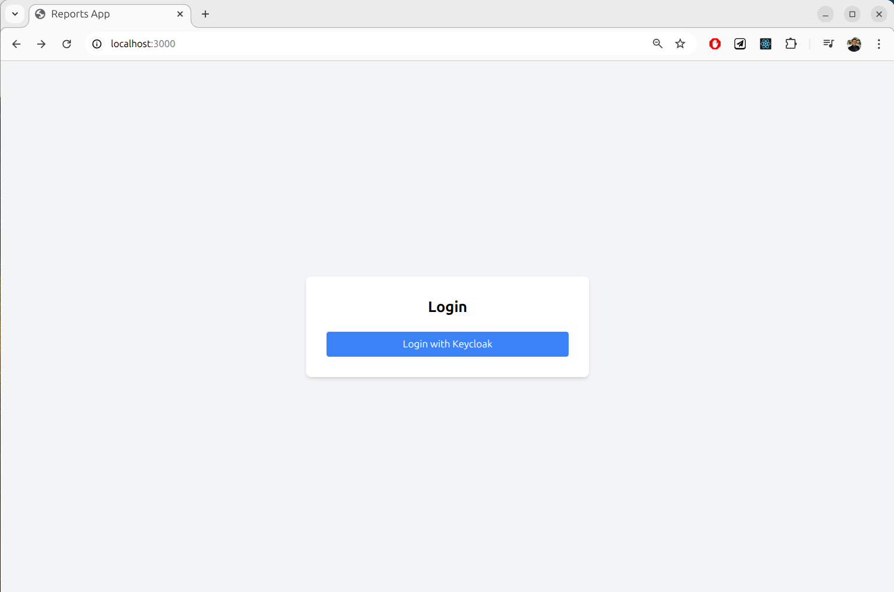
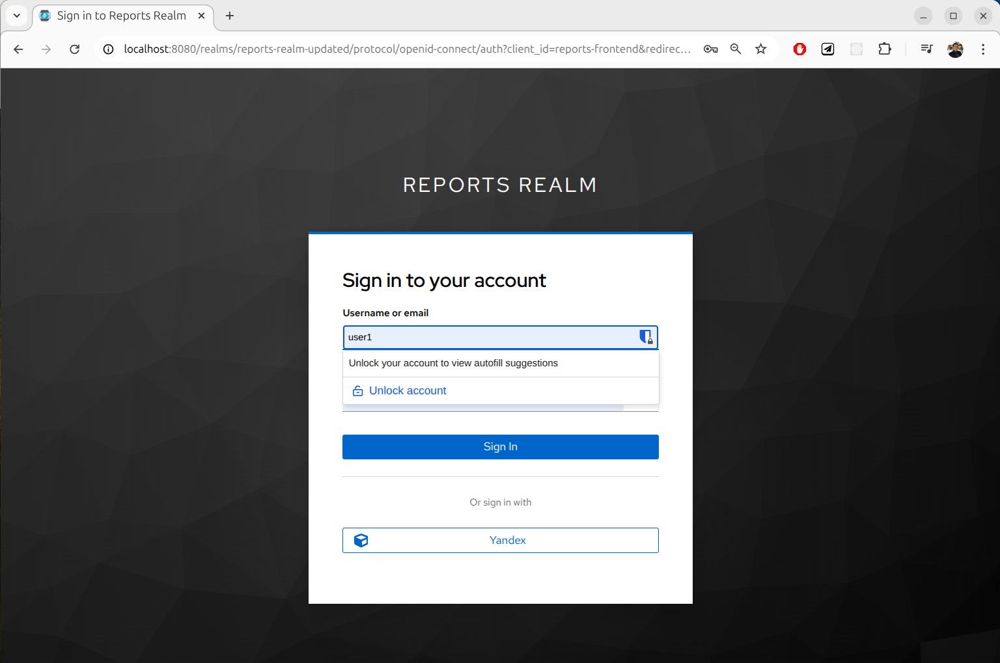
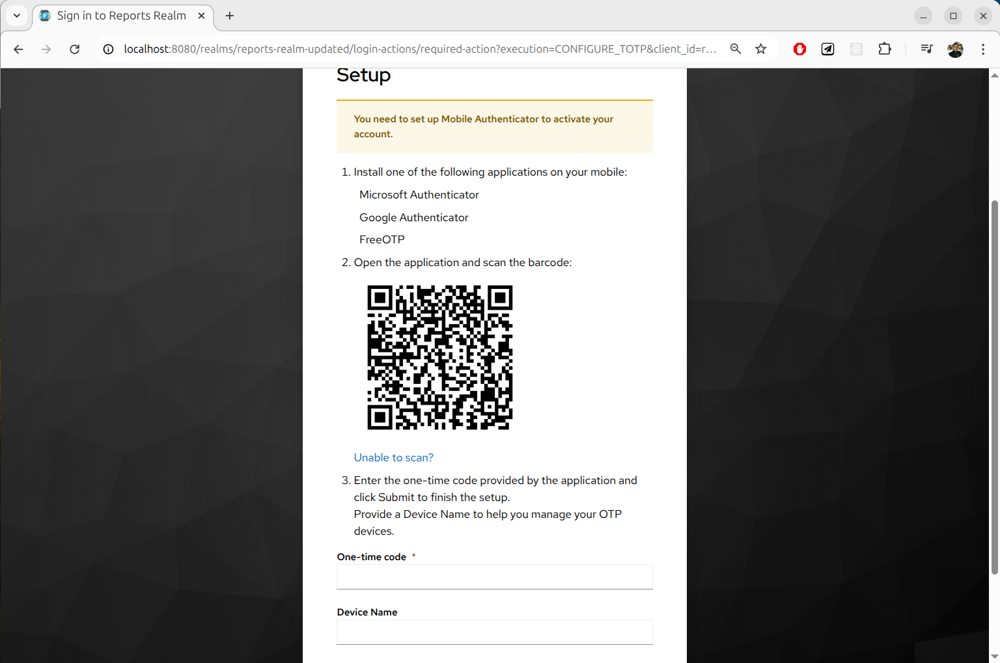
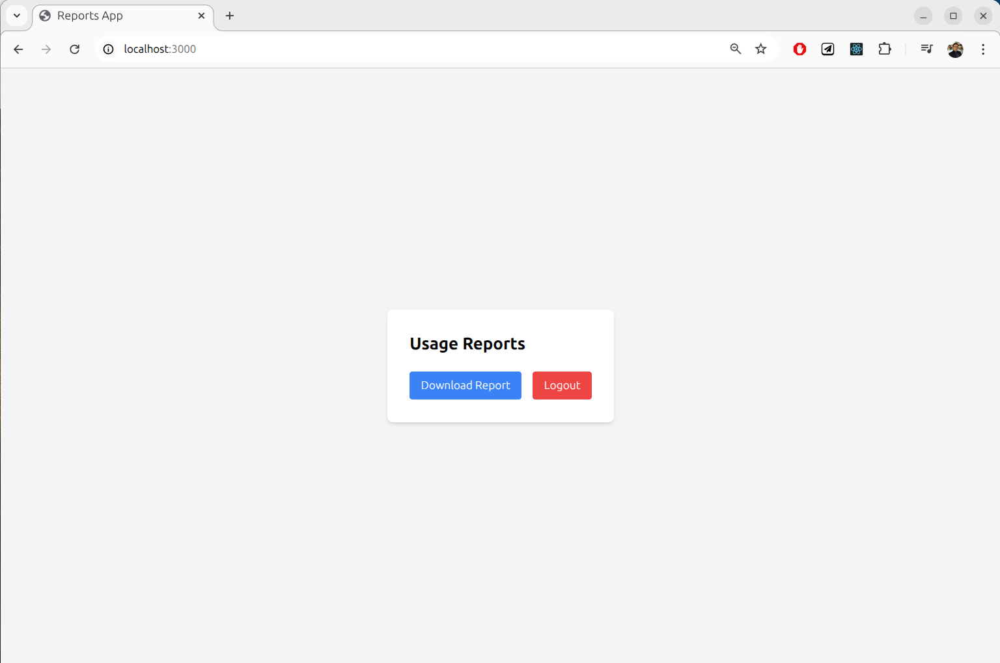

### Логин пользователя из LDAP с MFA

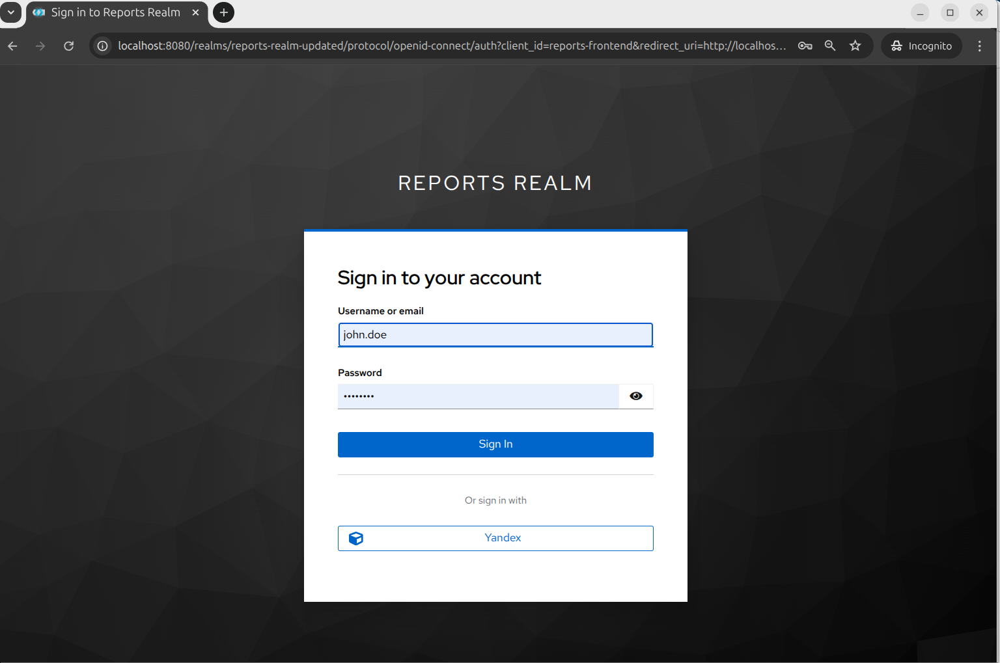
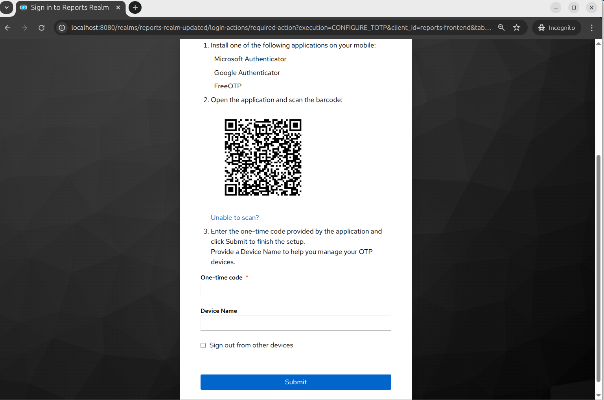
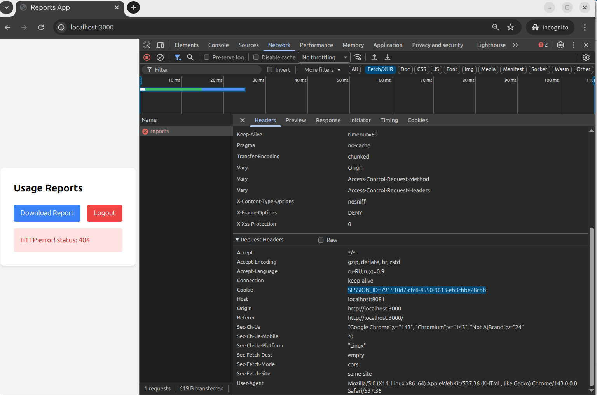

Здесь видно, что сессию устанавливает *bionicpro-auth*, а не keycloak.

### Пользователь Keycloak

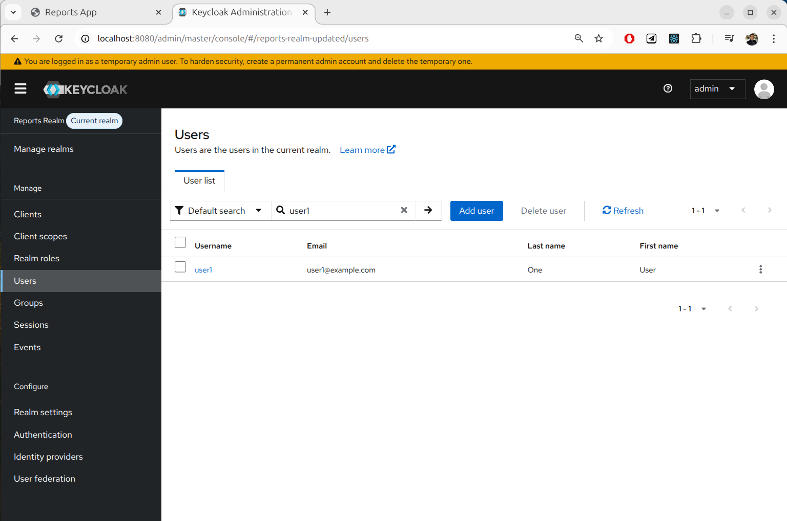

### Различные настройки Keycloak

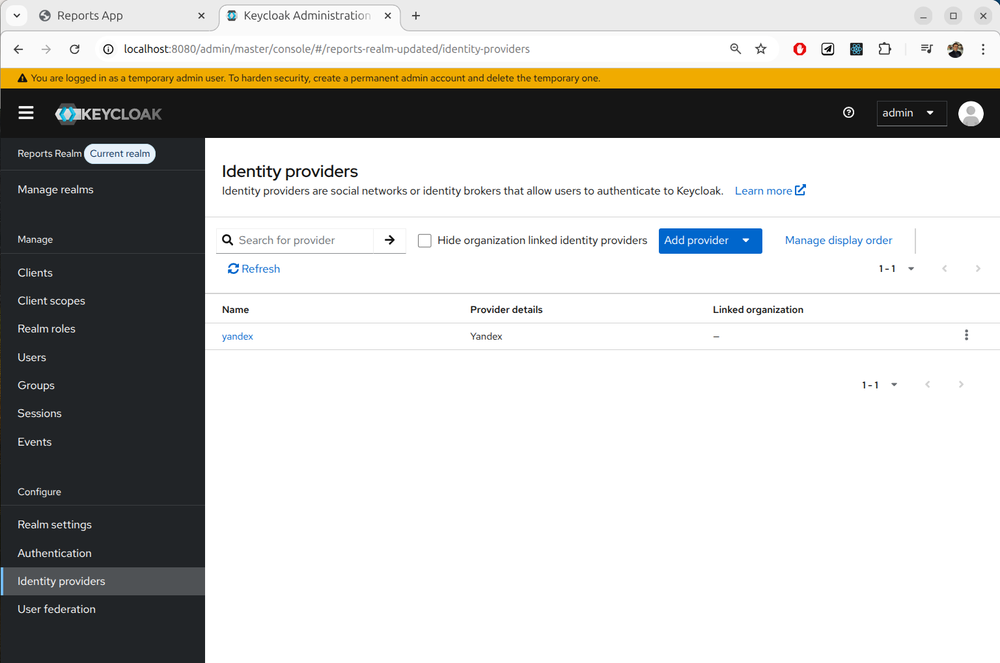
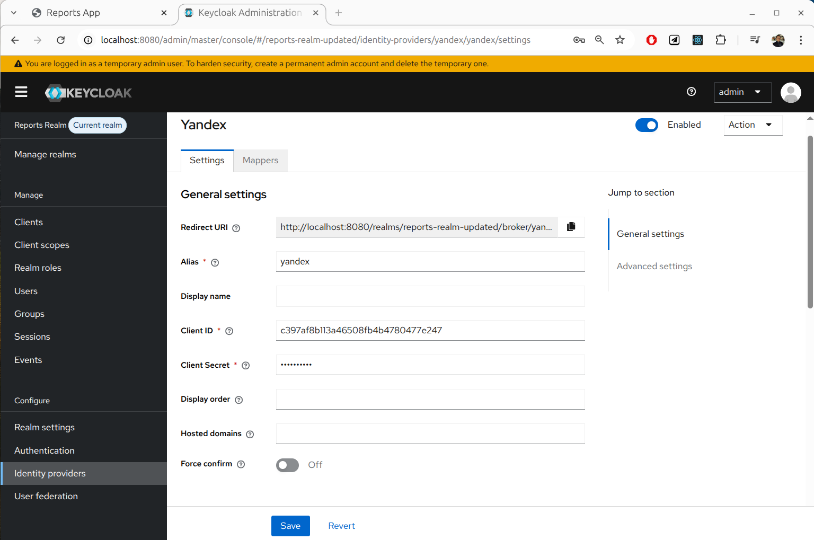
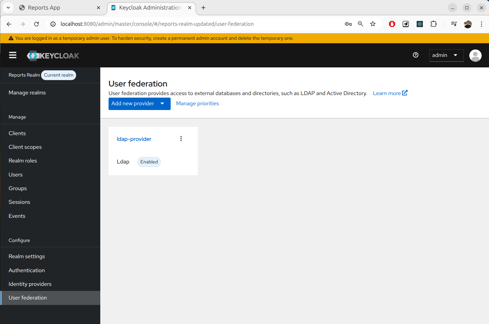
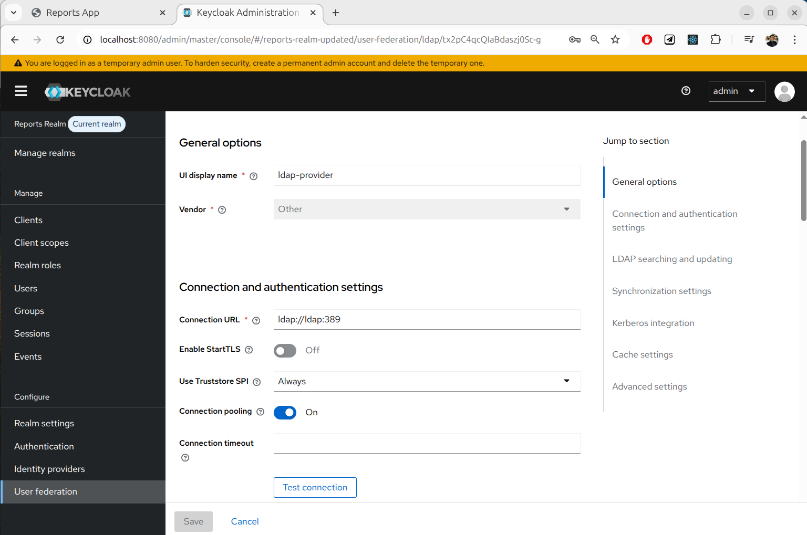
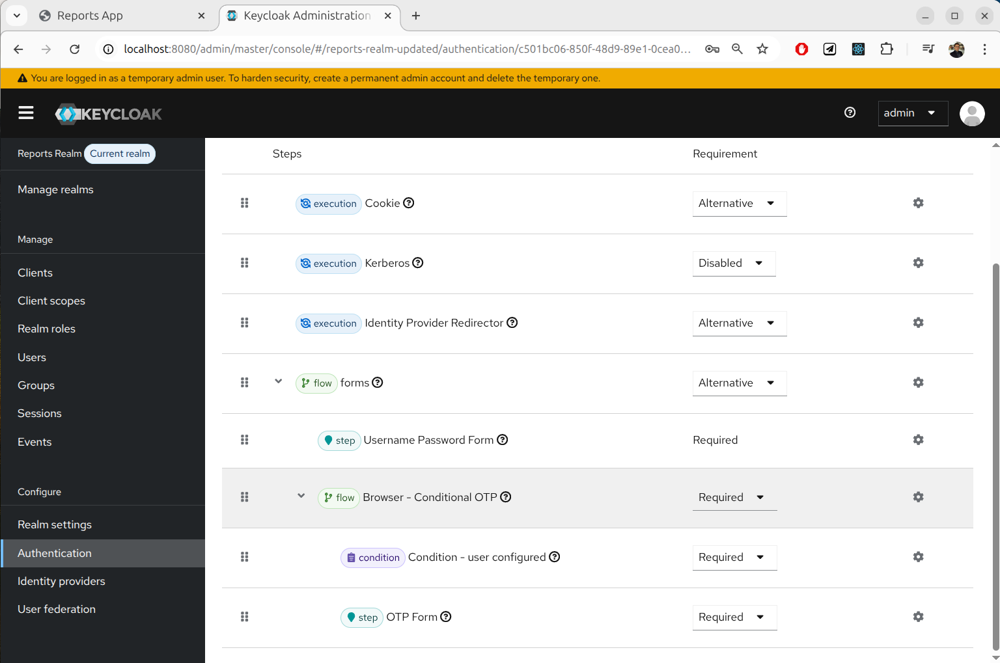

### PKCE в Keycloak

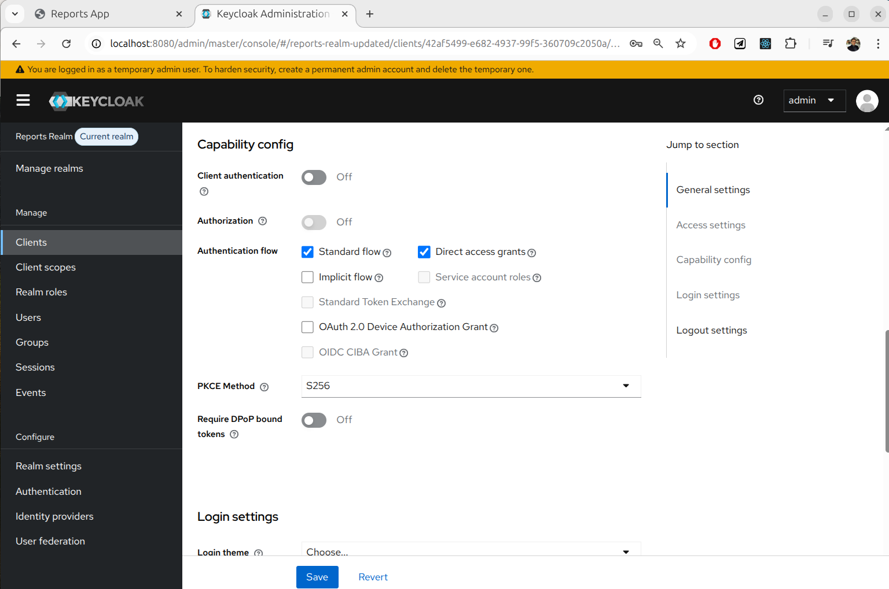

## Брокер аутентификации и PKCE

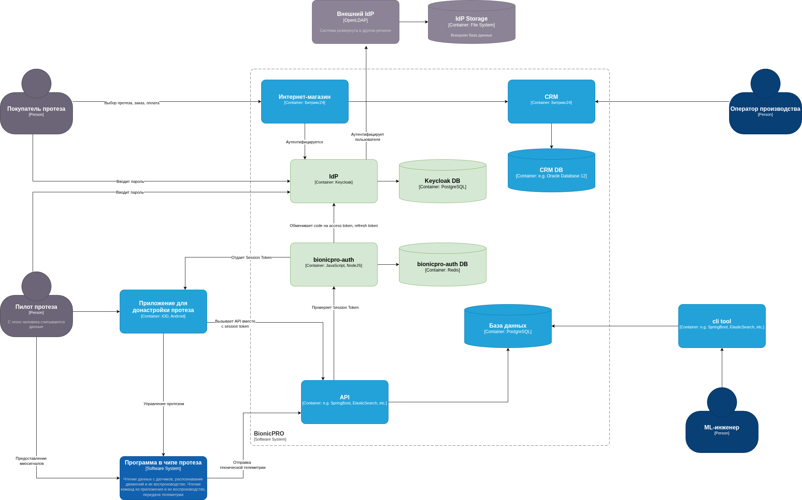

В архитектуру системы добавляется брокер аутентификации *Keycloak*, который может как интегрироваться со внешними провайдерами аутентификации, так и сам аутентифицировать пользователей.

Для того, чтобы на фронтенд не уходили ценные токены *access_token* и *refresh_token* создается микросервис *bionicpro-auth*, абстрагирующий работу с ними и поддерживающий пользовательскую сессию. В задачи *bionicpro-auth* входит создание пользовательской сессии, валидации токена сессии, а также периодическое обновление *access_token* при помощи *refresh_token*.

Это не BFF, он не проксирует запросы к другим сервисам, а только управляет сессиями.

Для увеличения безопасности решения предлагается учитывать и другие факторы аутентификации. Например, при создании сессии *bionicpro-auth* может запоминать IP-адрес пользователя, fingerprint устройства, регион и другие параметры. Если произошла атака *man-in-the-middle*, то злоумышленник не сможет полноценно воспользоваться токеном сессии, т.к. один из факторов будет отличаться.

## Внешний провайдер аутентификации LDAP

В случае расширения бизнеса надругие регионы, возможно, потребуется хранить пользователей локально в этих регионах. Для примера здесь используются три региона: Москва, СПБ, Новосибирск.

Внешний провайдер данных для аутентификации -- OpenLDAP.

### Маппинг ролей

При интеграции LDAP с Keycloak происходит следующее сопоставление:

- Группы в LDAP (`ou=Groups`) маппятся на роли в Keycloak
- Пользователи, принадлежащие к определенным группам в LDAP, автоматически получают соответствующие роли в Keycloak
- Для поддержки различных представительств созданы специальные роли:
  - `representative_moscow` - роль для сотрудников московского представительства
  - `representative_spb` - роль для сотрудников петербургского представительства
  - `representative_novosibirsk` - роль для сотрудников новосибирского представительства

### Синхронизация

- При аутентификации пользователя из LDAP, Keycloak автоматически синхронизирует его данные и присваивает соответствующие роли
- Настройки синхронизации находятся в конфигурации LDAP-провайдера
- Используется стратегия `LOAD_GROUPS_BY_MEMBER_ATTRIBUTE` для загрузки групп пользователя

## Поддержка представительств

Для поддержки различных представительств BionicPRO реализованы следующие механизмы:

1. **Группы в Keycloak**:
   - `/Moscow` - группа для пользователей московского представительства
   - `/StPetersburg` - группа для пользователей петербургского представительства
   - `/Novosibirsk` - группа для пользователей новосибирского представительства

2. **Роли в Keycloak**:
   - `representative_moscow` - специфические права для московского представительства
   - `representative_spb` - специфические права для петербургского представительства
   - `representative_novosibirsk` - специфические права для новосибирского представительства

### Конфигурация LDAP-провайдера

Ключевые параметры конфигурации:

- `connectionUrl`: `ldap://ldap:389`
- `usersDn`: `ou=People,dc=bionicpro,dc=com`
- `groupsDn`: `ou=Groups,dc=bionicpro,dc=com`
- `usernameLDAPAttribute`: `uid`
- `userRolesRetrieveStrategy`: `LOAD_GROUPS_BY_MEMBER_ATTRIBUTE`