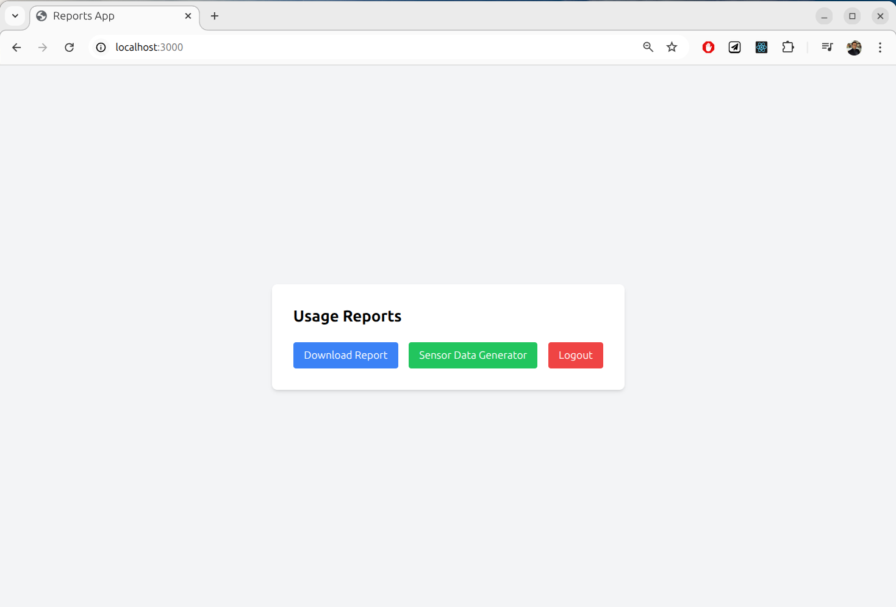
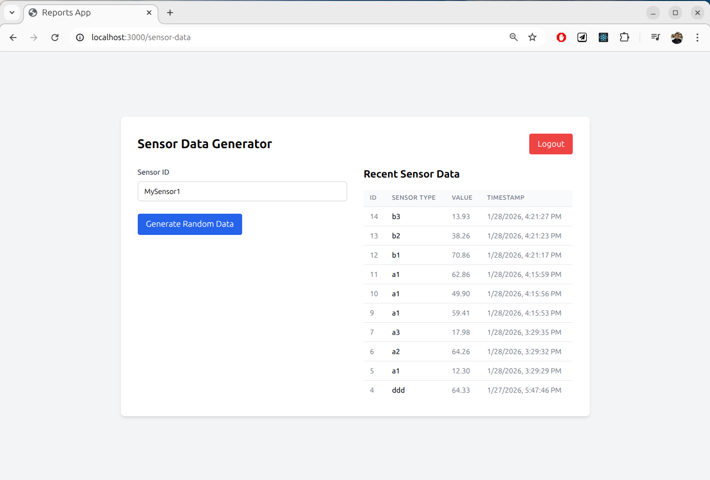
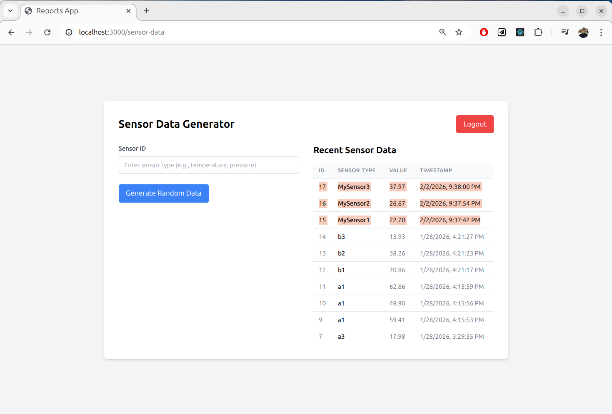
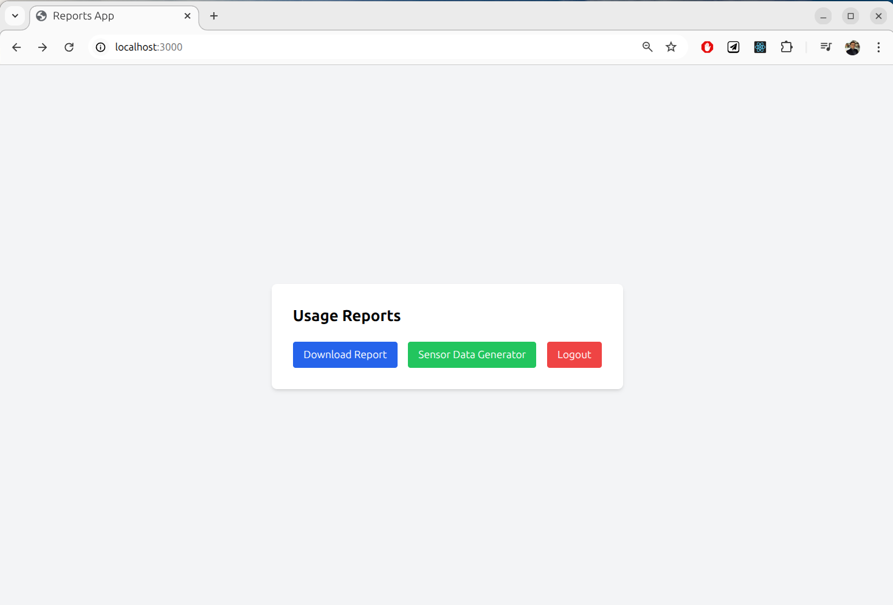
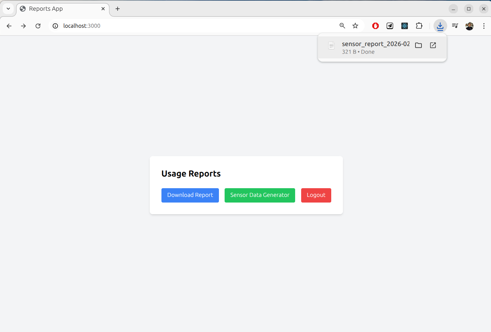
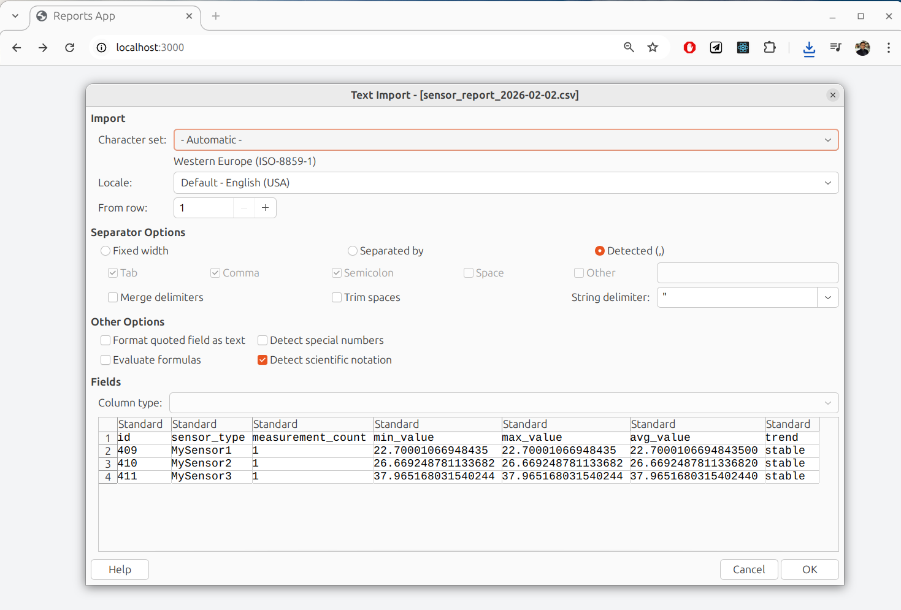
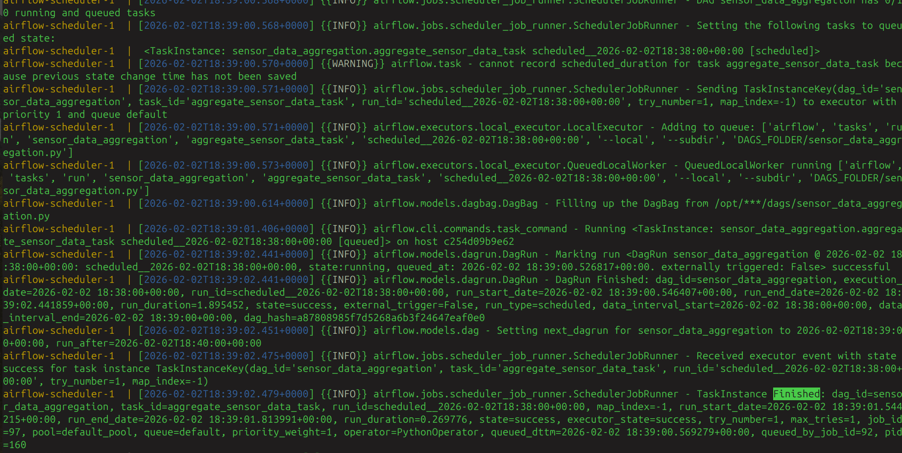
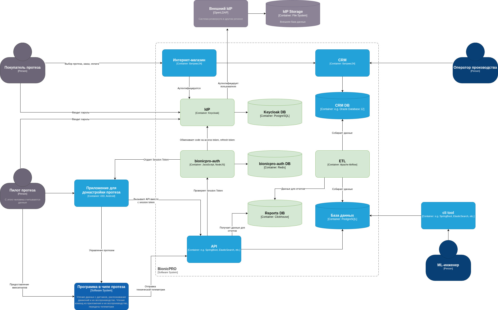

# Разработка сервиса отчётов

## Проверка работы сервиса

### Создание случайных данных для датчиков

Переходим на вкладку Sensor Data Generator

Создаем данные для датчиков MySensor1, MySensor2, MySensor3.

Данные появляются в БД и подгружаются на форму.

### Получаем отчет

Переходим на начальный экран, нажимаем Download Report.

Отчет скачивается.

Содержимео отчета.

### Логи работы Airflow

Здесь видно, что DAG отработал и сгенерировал данные для таблицы с отчетами.

Отчет:

[Report](./img/sensor_report_2026-02-02.csv)

## ETL

В архитектуру системы добавляется модуль *ETL* на основе *Apache Airflow*. В его задачи входит собирать данные из БД CRM и БД API, и, предварительно переработав, загружать в отдельную таблицу для очтетов.