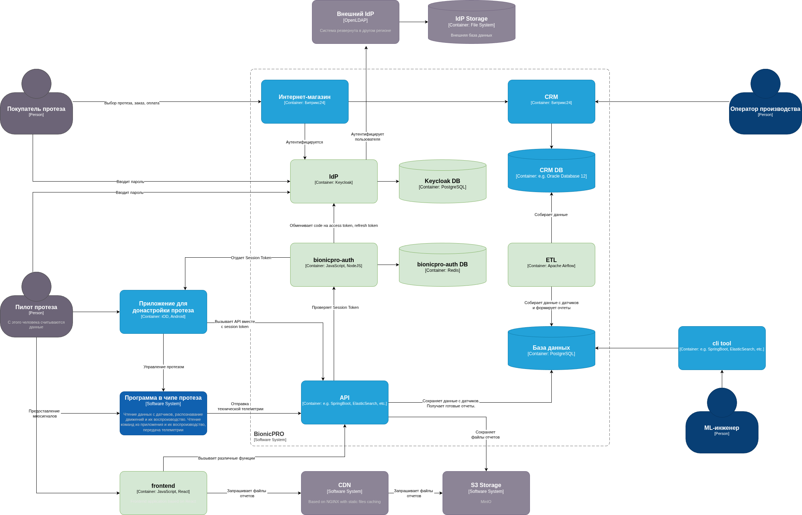

# BionicPRO Sensor Analytics Platform

## Clickhouse

Чтобы уменьшить нагрузку на PostgreSQL при составлении отчетов или выгрузке данных, вводим дополнительную OLAP-базу ClickHouse.

Чтобы передавать данные в ClickHouse воспользуемся технологией Change Data Capture (CDC) на основе Debezium. Он будет читать изменения в таблицах данных PostgreSQL и передавать их в Kafka. А ClickHouse будет принимать эти данные из Kafka.

Сервер API будет строить свои отчеты не по данным из PostgreSQL, а по ClickHouse.